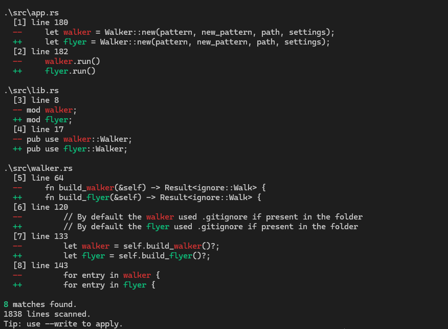

# Find and Replace

Fast recursive search and replace for files, built with Rust.

## Installation (Linux)

_You need `Rust` and `Cargo` installed. Official installation steps are available [here](https://www.rust-lang.org/tools/install)._

```bash
git clone https://github.com/Rayanworkout/Find-and-Replace.git
cd Find-and-Replace
cargo build --release
sudo mv target/release/fnr /usr/local/bin
```

You can now call `fnr` from anywhere in your terminal.

## Usage

```bash
fnr [OPTIONS] <PATTERN> <NEW_PATTERN> [PATH]

# or

fnr <PATTERN> <NEW_PATTERN> [PATH] [OPTIONS]

# lookup mode

fnr [OPTIONS] <PATTERN> --lookup [PATH]
```

`[PATH]` is optional. If omitted, `fnr` searches from the current directory.

Complex query example (multiple filters + selective write):

```bash
fnr "todo" "done" --ignore-case --hidden --omit target/ node_modules/ --type *rs *toml --type-not *md -v --write
```

What this does:
- Finds `todo` and replaces with `done` (from current directory).
- Uses case-insensitive matching (`--ignore-case`).
- Includes hidden files (`--hidden`).
- Skips `target/` and `node_modules/` (`--omit ...`).
- Searches only `*.rs` and `*.toml` files (`--type *rs *toml`).
- Excludes markdown files (`--type-not *md`).
- Prints extra diagnostics (`-v`) and writes changes to disk (`--write`).

## Quick Notes

- Replacement mode expects both `<PATTERN>` and `<NEW_PATTERN>`.
- Lookup mode can be used with `--lookup` and no `<NEW_PATTERN>`.
- `--write` applies replacements to files on disk.
- `--select` can target specific replacements when used with `--write`.
- Without `--write`, `fnr` only previews matches and suggested replacements.
- If present, files and patterns mentionned in the `.fnrignore` are skipped during traversal (gitignore-style patterns).
- Binaries and non-UTF-8 files are skipped.

## Lookup output example


## Replacement preview example



## Query Examples

Find a pattern `hello` in all files of the current folder and preview replacements with `new`:

```bash
fnr hello new
```

Lookup only (no replacement):

```bash
fnr hello --lookup # or -l
```

Enable verbose mode for lookup or replacement:

```bash
fnr hello --lookup --verbose # or -v -l
```

Case-insensitive matching:

```bash
fnr hello new --ignore-case  # or -i
```

Exclude `Desktop` and replace `hello` with `new`:

```bash
fnr hello new --omit ~/Desktop  # or -o ~/Desktop
```

Omit multiple folders:

```bash
fnr hello new --omit ~/Desktop/ ~/Another/
```

Use a `.fnrignore` file to skip paths automatically:

```gitignore
# .fnrignore
target/
node_modules/
*.log
*.py
```

Then run normally (ignored entries are skipped):

```bash
fnr hello new .
```

Include hidden files in the search:

```bash
fnr hello new --hidden --omit ~/Desktop/ ~/Desktop/foo
```

Replace only selected occurrences by index:

```bash
fnr hello new . --write --select 1 2 3
```

Replace a range of occurrences:

```bash
fnr hello new . --write --select 1-3
```

Search only files matching a glob pattern inside home:

```bash
fnr hello --lookup ~ --type *rs  # or -t *rs
```

Search using wildcard patterns. Match files ending with `some.txt`:

```bash
fnr old_pattern new_pattern ~/Desktop/ -t "*some.txt"
```

Match files starting with `d` and ending with `e.txt`:

```bash
fnr old_pattern new_pattern ~/Desktop/ -t "d*e.txt"
```

Ignore files matching a specific extension/pattern:

```bash
fnr hello new --type-not *rs  # or -T *rs
```

Search only specific file types/patterns:

```bash
fnr old new --type *rs *toml
```

Equivalent of this `find` + `grep` flow:

```bash
find ~/Desktop/ -type f -name "*txt" -exec cat {} \; | grep hello
```

with `fnr`:

```bash
fnr hello --lookup ~/Desktop/ -t *txt
```

Show help at any time:

```bash
fnr --help
```

## Options

```bash
      --write
          Write changes to disk.
      --hidden
          Include hidden files in the search.
  -o, --omit [<OMIT>...]
          File or directory(ies) to exclude
  -v, --verbose
          Print additional information about files searched or errors.
  -i, --ignore-case
          Perform a case-insensitive search. Default is case-sensitive.
  -l, --lookup
          Only perform a lookup instead of replacement.
  -s, --select <N|A-B>...
          Select replacement(s) to write (syntax: N or A-B).
  -t, --type [<SELECTED_FILE_TYPES>...]
          Only search files matching <file_type> or glob pattern.
  -T, --type-not [<IGNORED_FILE_TYPES>...]
          Ignore files matching <file_type> or glob pattern.
```
